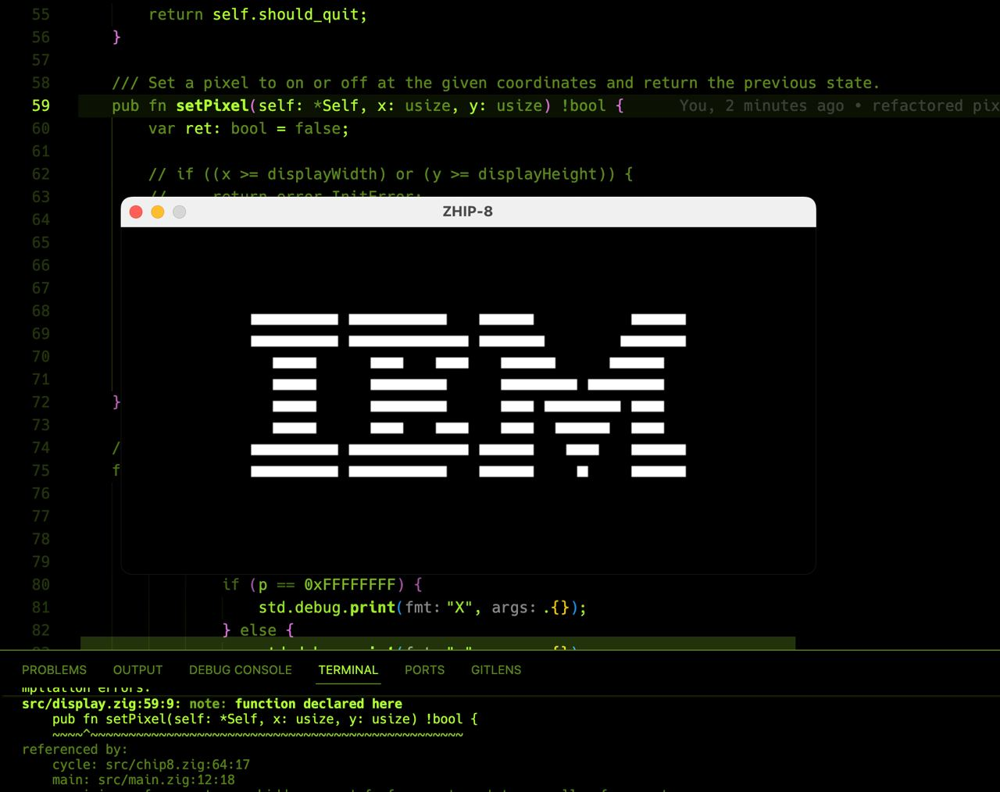

# ZHIP-8


ZHIP-8 is a Chip-8 emulator written in Zig. Chip-8 is an interpreted programming language that was first used in the mid-1970s. It was initially used on 8-bit microcomputers and has since been ported to various systems.

The specification was provided in this awesome guide by Tobias V. Langhoff: https://tobiasvl.github.io/blog/write-a-chip-8-emulator/

# Features
* Emulates the Chip-8 system
* Uses SDL2 for rendering
* Includes a suite of unit tests

# Structure
The project is structured as follows:

* src/chip8.zig: Contains the main Chip-8 emulation code.
* src/display.zig: Handles the display functionality using SDL2.
* src/font.zig: Contains the font set used by the Chip-8 system.
* src/main.zig: The main entry point of the application.
* src/rom.zig: Handles loading of ROM files.
* build.zig: The build script for the Zig project.

# Building and running
To build the project, run the following command in the root directory of the project:

```
zig build run
```

# Testing
To run the unit tests, run the following command in the root directory of the project:

```
zig build test
```